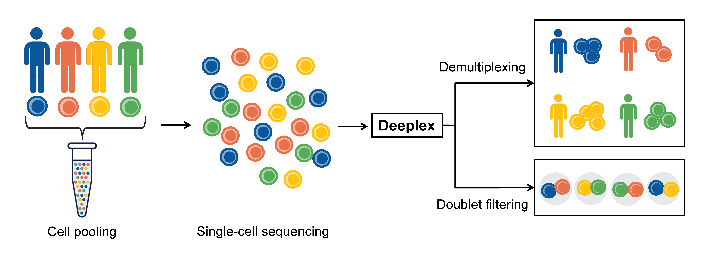
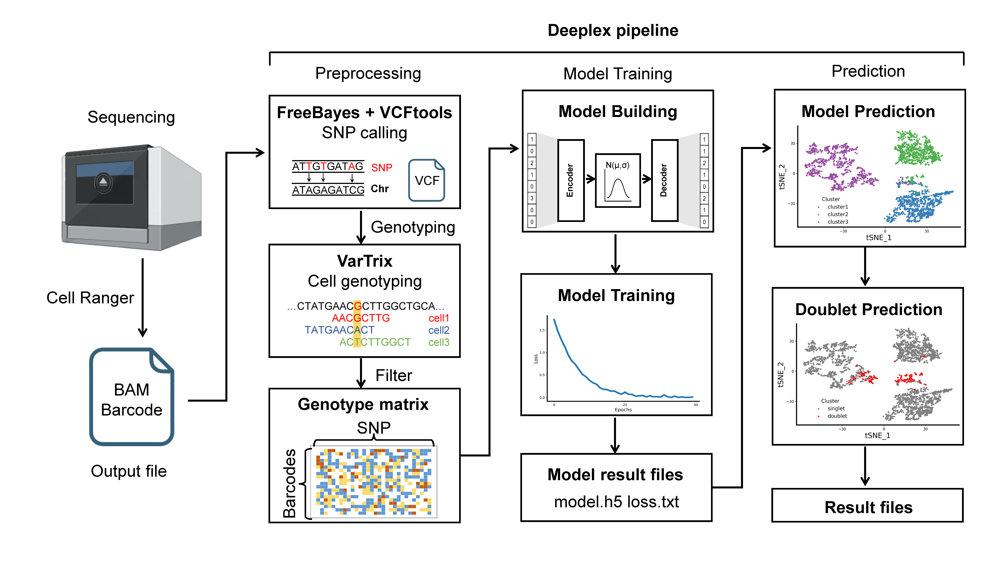
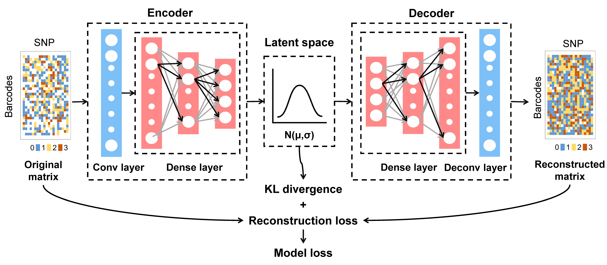

# Deeplex

---

**Deeplex：A variational autoencoder based demultiplexing approach for pooled single-cell sequencing data**

## Introduction

Deeplex is a deep learning-based method for clustering individuals in mixed-genotype single-cell RNA-seq experiments.

### Purpose of Deeplex



### Overview of the Deeplex Pipeline



The input files required by Deeplex are the BAM file (`possorted_genome_bam.bam`) generated by [Cell Ranger](https://www.10xgenomics.com/support/jp/software/cell-ranger/8.0/getting-started/cr-what-is-cell-ranger), the barcode file containing all cell barcodes (`barcodes.txt`), and an appropriate reference genome.

Deeplex consists of four main steps. It first uses several commonly used tools ([freebayes](https://github.com/freebayes/freebayes), [vcftools](https://github.com/vcftools/vcftools), and [VarTrix](https://github.com/10XGenomics/vartrix)) for data preprocessing to generate the matrix required for model training. Finally, the model is used for data reconstruction, cell clustering, and doublet identification.

1. Preprocessing (**prepare.py**): Calling candidate SNPs ([**freebayes**](https://github.com/freebayes/freebayes) and [**vcftools**](https://github.com/vcftools/vcftools)) and Cell genotype counting ([**VarTrix**](https://github.com/10XGenomics/vartrix));
2. Train the model (**deeplex.py**);
3. Cluster cells using the trained model (**prediction.py**);
4. Calling doublets (**doublet.py**);

### Schematic of the Model Architecture



### Modes of Operation in Deeplex

Deeplex supports two modes of operation:

1. Using the pipeline script (**`pipeline.py`**) to run all steps sequentially;
2. Running each step separately without the pipeline script (**`prepare.py`**, **`deeplex.py`**, **`prediction.py`**, **`doublet.py`**).

## Citation

If you find this tool useful, please cite:

----

https://github.com/Deeplex-Xulab/Deeplex

https://deeplex-xulab.github.io/

----


## Using the pipeline script

A typical command looks like this:

```shell
singularity exec deeplex.sif pipeline.py -g <reference.fasta> -b <possorted_genome_bam.bam> -c <barcodes.txt> -cn <cluster_num> -o <output_dir>
```

The options for using **`pipeline.py`** are:

```shell
singularity exec deeplex.sif pipeline.py -h
usage: pipeline.py [-h] [-H] [-g GENOME] [-b BAM] [-c BARCODE]
                   [-o OUT] [-bn BATCH_NUM] [-en EPOCH_NUM]
                   [-ld LATENT_DIM] [-cn CLUSTER_NUM]
                   [-si SHOW_INFO] [-tr TEST_RADIO]
                   [-vr VALID_RADIO] [-s SEED]
                   [-lr LEARNING_RATE] [-it IMG_TYPE]
                   [-p PREFIX] [-pc PLOT_CENTER] [-f FRACTION]

In Deeplex’s pipeline mode, the steps are executed sequentially in the following order: prepare.py, deeplex.py, prediction.py, and doublet.py. You can use the -H option to get the help message for each step.

optional arguments:
  -h, --help            show this help message and exit
  -H, --HELP            Help message for each step
  -g GENOME, --genome GENOME
                        Reference genome
  -b BAM, --bam BAM     BAM file
  -c BARCODE, --barcode BARCODE
                        Barcode list
  -o OUT, --out OUT     Output Directory
  -bn BATCH_NUM, --batch_num BATCH_NUM
                        Number of batch, default 16
  -en EPOCH_NUM, --epoch_num EPOCH_NUM
                        Number of epoch, default 25
  -ld LATENT_DIM, --latent_dim LATENT_DIM
                        latent dimension, default 4
  -cn CLUSTER_NUM, --cluster_num CLUSTER_NUM
                        Number of clusters, default 3
  -si SHOW_INFO, --show_info SHOW_INFO
                        Whether to display detailed information, default True
  -tr TEST_RADIO, --test_radio TEST_RADIO
                        Ratio of test set, default 0.2
  -vr VALID_RADIO, --valid_radio VALID_RADIO
                        Ratio of validation set, default 0.2
  -s SEED, --seed SEED  Random seed, default 42
  -lr LEARNING_RATE, --learning_rate LEARNING_RATE
                        Learning rate, default 0.0001
  -it IMG_TYPE, --img_type IMG_TYPE
                        Image type (tSNE/UMAP), default tSNE
  -p PREFIX, --prefix PREFIX
                        Output prefix, default vae_
  -pc PLOT_CENTER, --plot_center PLOT_CENTER
                        Do you want to draw cluster centers, default False
  -f FRACTION, --fraction FRACTION
                        Is the percentage of doublet cells known in advance, default False
```

## Running each step separately without the pipeline script

### Step 1: Preprocessing (prepare.py)

- Calling candidate SNPs (freebayes and vcftools): Use [**freebayes**](https://github.com/freebayes/freebayes)  to detect variant sites (SNVs) from the pooled single-cell RNA-seq data. Then, use [**vcftools**](https://github.com/vcftools/vcftools) to filter and retain only the **SNP** sites.

```shell
freebayes -f <reference.fasta> <possorted_genome_bam.bam> -C 2 -q 30 -n 3 -E 1 -m 30 --min-coverage 40 --pooled-continuous
```

```shell
vcftools --vcf <call_snv.vcf> --remove-indels --recode --recode-INFO-all --out <prefix>
```

- Cell genotype counting (VarTrix): Use [**VarTrix**](https://github.com/10XGenomics/vartrix) to count the genotype of each cell at each candidate SNP site calling in Step 1, applying the `consensus` scoring method of VarTrix.

```shell
vartrix_linux --scoring-method consensus --vcf <prefix.recode.vcf> --bam <possorted_genome_bam.bam> --fasta <reference.fasta> --cell-barcodes <barcodes.txt> --threads 10 --out-matrix <all.mtx>
```

- Next, the resulting sparse matrix is converted into a matrix with SNPs as columns and cells as rows.
- Finally, the initial matrix is usually quite large, which can be computationally intensive for downstream training. Therefore, a filtering step is applied: by default, SNPs missing in 99% of cells and SNPs with genotypes identical to the reference in 95% of cells are removed, retaining only those SNPs with high variability.

A typical command looks like this:

```shell
singularity exec deeplex.sif prepare.py -g <reference.fasta> -b <possorted_genome_bam.bam> -c <barcodes.txt> -o <output_dir>
```

The options for using **`prepare.py`** are:

```shell
singularity exec deeplex.sif prepare.py -h
usage: prepare.py [-h] [-g GENOME] [-b BAM] [-c BARCODE] [-o OUT]

Preparation of training data. Provide a BAM file, a barcode list, and a reference genome as input to prepare data for model training.

optional arguments:
  -h, --help            show this help message and exit
  -g GENOME, --genome GENOME
                        Reference genome
  -b BAM, --bam BAM     BAM file
  -c BARCODE, --barcode BARCODE
                        Barcode list
  -o OUT, --out OUT     Output Directory
```

Output directory structure:

```text
output/
├── deeplex_prepare.log: Log file generated by the prepare step
└── __prepare__: Output directory of the prepare step
    ├── freebayes: Output directory of freebayes
    │   ├── freebayes.completed: Indicates that freebayes has finished; delete this file to rerun the step
    │   ├── freebayes.vcf: freebayes VCF file generated by freebayes
    │   ├── SNPs_rmindel.recode.vcf: SNP VCF file filtered from freebayes.vcf using vcftools
    │   └── vcftools.completed: Indicates that vcftools has finished; delete this file to rerun the step
    └── vartrix: Output directory of vartrix
        ├── filter.completed: Indicates that filtering is complete; delete this file to rerun the step
        ├── matrix.completed: Indicates that conversion from sparse to dense matrix is complete; delete to rerun
        ├── matrix_filter.txt: Matrix after filtering
        ├── matrix_final.txt: Final matrix used for training
        ├── matrix.txt: Dense matrix converted from sparse format
        ├── SNPs.loci.txt: File listing all SNP loci
        ├── vartrix.completed: Indicates that vartrix has finished; delete this file to rerun the step
        └── vartrix.mtx: Sparse matrix output by vartrix
```

### Step 2: Train the model (deeplex.py)

- The resulting matrix (`matrix_final.txt`) is used to train the Deeplex model, which is based on a variational autoencoder (VAE).

A typical command looks like this:

```shell
singularity exec deeplex.sif deeplex.py -m <matrix_final.txt> -c <cluster_num> -o <output_dir>
```

The options for using **`deeplex.py`** are:

```shell
singularity exec deeplex.sif deeplex.py -h
usage: modelTraining.py [-h] [-m MTX] [-bn BATCH_NUM] [-en EPOCH_NUM]
                        [-ld LATENT_DIM] [-c CLUSTER] [-si SHOW_INFO]
                        [-tr TEST_RADIO] [-vr VALID_RADIO] [-s SEED]
                        [-lr LEARNING_RATE] [-it IMG_TYPE] [-o OUT]

Model training. Input the required data to train the model.

optional arguments:
  -h, --help            show this help message and exit
  -m MTX, --mtx MTX     Matrix file
  -bn BATCH_NUM, --batch_num BATCH_NUM
                        Number of batch, default 16
  -en EPOCH_NUM, --epoch_num EPOCH_NUM
                        Number of epoch, default 25
  -ld LATENT_DIM, --latent_dim LATENT_DIM
                        latent dimension, default 4
  -c CLUSTER, --cluster CLUSTER
                        Number of clusters, default 3
  -si SHOW_INFO, --show_info SHOW_INFO
                        Whether to display detailed information, default True
  -tr TEST_RADIO, --test_radio TEST_RADIO
                        Ratio of test set, default 0.2
  -vr VALID_RADIO, --valid_radio VALID_RADIO
                        Ratio of validation set, default 0.2
  -s SEED, --seed SEED  Random seed, default 42
  -lr LEARNING_RATE, --learning_rate LEARNING_RATE
                        Learning rate, default 0.0001
  -it IMG_TYPE, --img_type IMG_TYPE
                        Image type (tSNE/UMAP), default tSNE
  -o OUT, --out OUT     Output Directory
```

Output directory structure:

```text
output/
├── deeplex_training.log: Log file for the training step
└── __train__: Output directory for the training step
    ├── deeplex_train.log: Log detailing the model training process
    ├── loss: Output directory for model loss metrics
    │   ├── kl_loss.pdf: Line plot of KL divergence during training
    │   ├── kl_loss.png
    │   ├── kl_loss.txt: KL divergence values during training
    │   ├── loss.pdf: Line plot of total loss during training
    │   ├── loss.png
    │   ├── loss.txt: Total loss values during training
    │   ├── recon_loss.pdf: Line plot of reconstruction loss during training
    │   ├── recon_loss.png
    │   └── recon_loss.txt: Reconstruction loss values during training
    ├── models: Directory containing model output
    │   └── model_025.weights.h5: Saved model weights
    ├── test_barcodes.list: List of cells used for the test set
    ├── train_barcodes.list: List of cells used for the training set
    ├── valid_barcodes.list: List of cells used for the validation set
    └── train.completed: Indicates that training is complete; delete this file to rerun the training
```

### Step 3: Cluster cells using the trained model (prediction.py)

- Use the trained model and the input matrix (`matrix_final.txt`) to perform clustering on each cell, resulting in an initial clustering outcome.

A typical command looks like this:

```shell
singularity exec deeplex.sif prediction.py -m <matrix_final.txt> -vm <model_file> -c <cluster_num> -o <output_dir>
```

- At this point, you can omit specifying the model file (e.g., `model_025.weights.h5`). The script will automatically read the best model path from the `output/__train__/deeplex_train.log` file.

The options for using **`prediction.py`** are:

```shell
singularity exec deeplex.sif prediction.py -h
usage: modelPrediction.py [-h] [-m MTX] [-vm VAE_MODEL] [-ld LATENT_DIM]
                          [-c CLUSTER] [-si SHOW_INFO] [-s SEED]
                          [-it IMG_TYPE] [-o OUT] [-p PREFIX]
                          [-pc PLOT_CENTER]

Model prediction. Using a trained model for prediction.

optional arguments:
  -h, --help            show this help message and exit
  -m MTX, --mtx MTX     Matrix file
  -vm VAE_MODEL, --vae_model VAE_MODEL
                        Trained VAE model
  -ld LATENT_DIM, --latent_dim LATENT_DIM
                        Latent dimension, default 4
  -c CLUSTER, --cluster CLUSTER
                        Number of clusters, default 3
  -si SHOW_INFO, --show_info SHOW_INFO
                        Whether to display detailed information, default True
  -s SEED, --seed SEED  Random seed, default 42
  -it IMG_TYPE, --img_type IMG_TYPE
                        Image type (tSNE/UMAP), default tSNE
  -o OUT, --out OUT     Output Directory
  -p PREFIX, --prefix PREFIX
                        Output prefix, default vae_
  -pc PLOT_CENTER, --plot_center PLOT_CENTER
                        Do you want to draw cluster centers, default False
```

Output directory structure:

```text
output/
├── deeplex_prediction.log: Log file for the prediction step
└── __prediction__: Output directory for the prediction step
    ├── imgs: tSNE/UMAP dimensionality reduction clustering plots
    │   ├── vae_tSNE_pred.pdf
    │   └── vae_tSNE_pred.png
    └── results: Directory for prediction results
        ├── vae_tSNE_pred.txt: Predicted clustering results indicating the most likely single-cell origin for each cell
        └── vae_tSNE_result_data.txt: Coordinate data from tSNE/UMAP dimensionality reduction
```

### Step 4: Calling doublets (doublet.py)

- Based on the initial prediction results, the input matrix (`matrix_final.txt`) is used to calling doublets, producing the final prediction output.

A typical command looks like this:

```sh
singularity exec deeplex.sif doublet.py -m <matrix_final.txt> -s <single_prediction> -c <coordinate_file> -o <output_dir>
```

- Similarly, if the predicted single-cell results or the coordinate file of cells are not specified here, the script will automatically read from `output/__prediction__/results/vae_tSNE_pred.txt` or `output/__prediction__/results/vae_tSNE_result_data.txt`.
- Additionally, if the proportion of doublets in the dataset is known in advance, it can be specified using the `-f` parameter to assist in identifying doublets.

The options for using **`doublet.py`** are:

```shell
singularity exec deeplex.sif doublet.py -h
usage: doubletPrediction.py [-h] [-m MTX] [-s SINGLE_PRED]
                            [-c COORDINATE] [-f FRACTION] [-it IMG_TYPE]
                            [-o OUT] [-p PREFIX]

Doublet cell prediction. Based on the previous step's prediction results
for each cell, further predict which of them are doublets.

optional arguments:
  -h, --help            show this help message and exit
  -m MTX, --mtx MTX     Matrix file
  -s SINGLE_PRED, --single_pred SINGLE_PRED
                        tSNE_pred.txt, single cell prediction result file
  -c COORDINATE, --coordinate COORDINATE
                        tSNE_result_data.txt, tSNE/UMAP result data file
  -f FRACTION, --fraction FRACTION
                        Is the percentage of doublet cells known in advance, default False
  -it IMG_TYPE, --img_type IMG_TYPE
                        Image type (tSNE/UMAP), default tSNE
  -o OUT, --out OUT     Output Directory
  -p PREFIX, --prefix PREFIX
                        Output prefix, default vae_
```

Output directory structure:

```text
output/
├── deeplex_doublet.log: Log file for the doublet prediction process
└── __doublet__: Output directory for the doublet step
    ├── doublet.log: Log file for the doublet detection process
    ├── imgs: tSNE/UMAP dimensionality reduction clustering plots
    │   ├── vae_tSNE_pred_doublet.pdf: Distribution plot of detected doublets
    │   ├── vae_tSNE_pred_doublet.png
    │   ├── vae_tSNE_pred.pdf: Distribution plot of all clusters
    │   ├── vae_tSNE_pred.png
    │   ├── vae_tSNE_pred_rmdoublet.pdf: Distribution plot of clusters excluding doublets
    │   └── vae_tSNE_pred_rmdoublet.png
    └── results: Output directory for prediction results
        ├── doublet_barcodes.list: List of barcodes identified as doublets
        └── vae_tSNE_pred.txt: Final prediction results
```

vae_tSNE_pred.txt will look like: 

```text
barcode	prediction	best_single	doublet
CGGAATTTCGCCACTT-1	1	1	--
GTAATGCGTGGGCTCT-1	1	1	--
TACCTGCCAATACCTG-1	0	1	1,2
GTCCACTCAAGAGTGC-1	1	1	--
CAATGACCACCAGTTA-1	1	1	--
```

- The columns of the file represent the cell barcodes, the prediction results (including doublets), the best single-cell (singlet) cluster prediction for each cell, and the two most likely source clusters for doublets.

